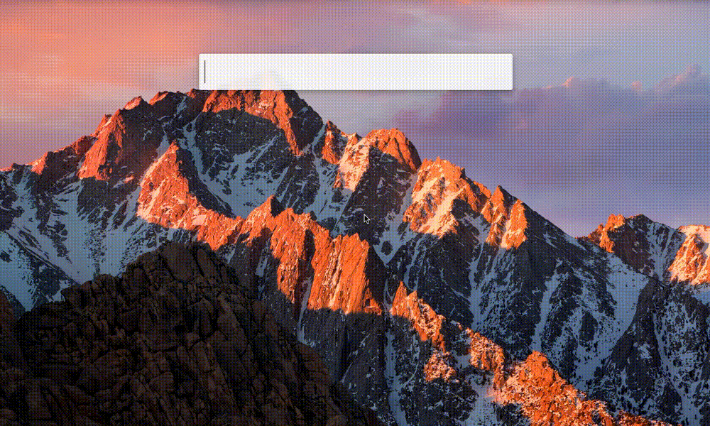

Alphy
=====



Alfred 3 workflow to search and get links for GIFs on
[Giphy](https://giphy.com), with previews in Quick Look. :ok_hand:


* [Installation](#installation)
* [Usage](#usage)
* [Advanced usage](#advanced-usage)
* [License and credits](#license-and-credits)
* [Todo](#todo)


## Installation

1. Download the latest version from [the releases
   page](https://github.com/maximepeschard/alphy/releases) of this repository.
2. Double-click the downloaded `.alfredworkflow` file to install.
3. That's it. :clap:

**Please note that this workflow is only for Alfred 3.**


## Usage

Fire up the workflow with the keyword `gif` followed by your search query. Once
the list is filled with results, the following actions are available for each
item :
* `<shift>` will open a Quick Look window showing the GIF (pressing
  `<shift>` again, `<esc>` or `<space>` will dismiss it),
* `<enter>` will copy the direct URL of the GIF file (eg.
  http://media3.giphy.com/media/l41YwWrjEhTGpE3zG/giphy.gif),
* `<cmd>+<enter>` will instead copy the Giphy URL of the GIF (eg.
  http://giphy.com/gifs/siliconvalleyhbo-l41YwWrjEhTGpE3zG),
* `<alt>+<enter>` will open the GIF on Giphy.

An extra action is always displayed at the bottom to open the current search on
Giphy in the default browser.


## Advanced usage

### Keyword

The default keyword is `gif` (easy to remember :grin:), but can easily be
changed by going to the Workflows tab of the Alfred settings, clicking the
workflow, double-clicking the (first) 'Script Filter' action and typing the
desired keyword. 

### Search limit

By default, only the first 8 results are displayed. However, this setting can be
changed by going to the workflow settings (following the above directions),
toggling the 'Workflow variables' pane by clicking the [x] icon and changing the
`GIPHY_SEARCH_LIMIT` variable.

### Cache management

This workflow makes use of Alfred cache to store some search results and avoid
repeated and unnecessary calls to Giphy API. To clear the cache, just type the
following sequence :

```
gif :delcache
```


## License and credits

This workflow is released under the [MIT
License](https://opensource.org/licenses/MIT).

This workflow uses the
[Alfred-Workflow](https://github.com/deanishe/alfred-workflow) helper library by
[deanishe](https://github.com/deanishe), also released under the [MIT
License](https://opensource.org/licenses/MIT).

This workflow uses the [Giphy public API](https://github.com/Giphy/GiphyAPI).


## Todo

* Add still images from Giphy as results icons ?
* Request API production key

